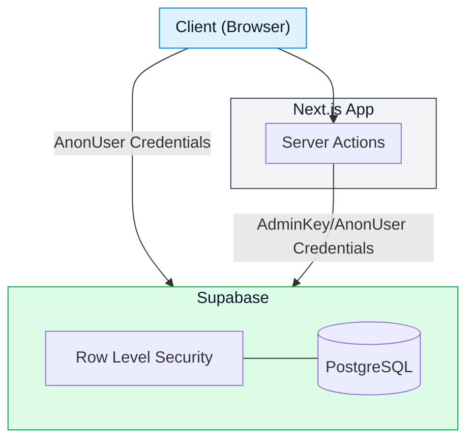
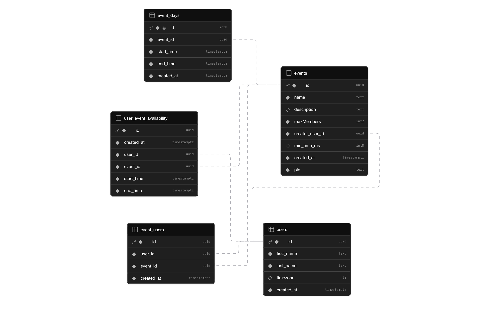
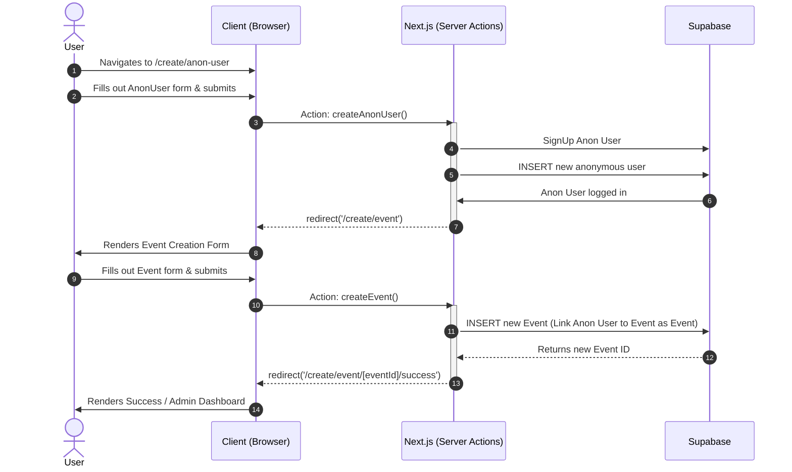
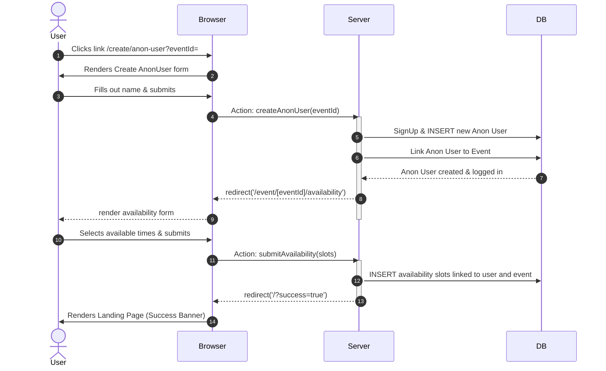
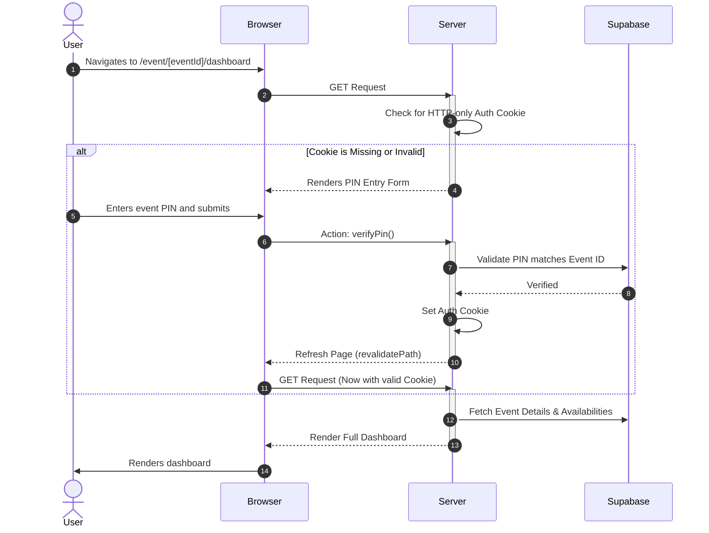

# Are You Free

The easiest way to find a time that works for everyone in your group.
Simply create an event, share the link with your friends, and let everyone pick their available times. The app will automatically find the best times that work for everyone.

_The name "Sync Up" was changed to Are You Free since "Sync Up" was taken :/_

Live Project: [www.areyoufree.xyz](https://areyoufree.xyz)

## Getting Started

### 1. Clone the repository

```bash
git clone https://github.com/eltonSalanic/sync-up.git
cd sync-up
```

### 2. Supabase Database Setup

To get your own database running, you can completely skip the CLI.

1. Create a new project on your [Supabase Dashboard](https://supabase.com/dashboard).
2. Navigate to the **SQL Editor** on the left panel.
3. Copy the entire contents of the `initial_schema.sql` file included in this repository.
4. Paste it into the SQL Editor and click **Run**.

_(This will instantly generate all the necessary tables, relationships, Row Level Security policies, and user constraints required for the app to work!)_

### 3. Set up Environment Variables

Before running the app, you need to connect it to your Supabase project.

1. Copy the example environment file:

   ```bash
   cp .env.example .env.local
   ```

2. Open `.env.local` and add your **Supabase URL**, **Publishable Key**, and **Secret Key**. You can find these in your Supabase project settings.

### 4. Install Dependencies

This project uses `pnpm` as its package manager.
`pnpm install`

### 5. Run the Development Server

Start the local Next.js server:
`pnpm dev`

Open [http://localhost:3000](http://localhost:3000) with your browser to see the app running!

## Application Architecture



## Database ERD



## Application Flows

### Create Event Flow



### User Join Event Flow



### User View Dashboard Flow


