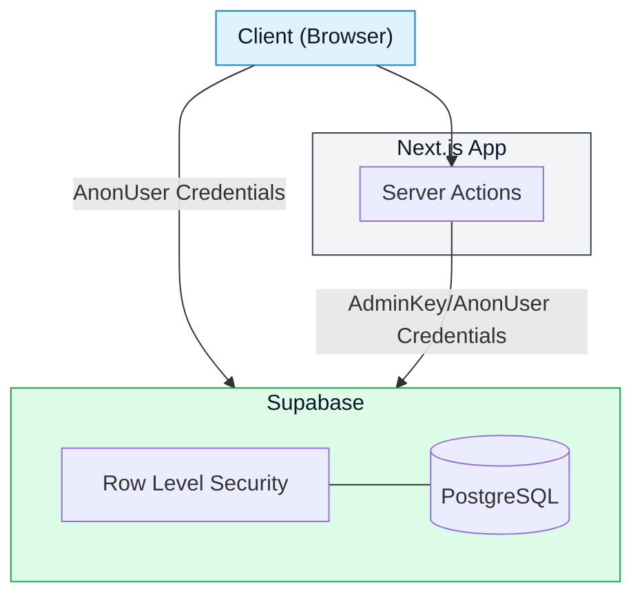
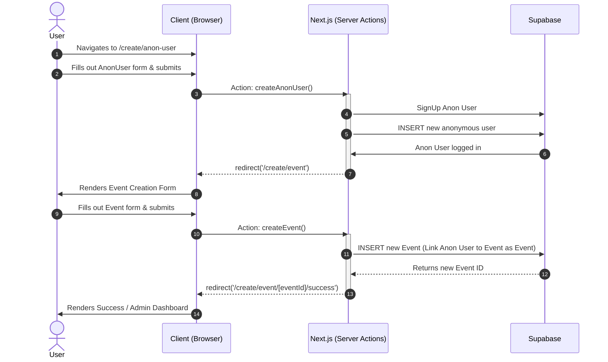

# Are You Free

_The name "Sync Up" was changed to Are You Free since sync up was taken :/_

## Application Architecture

```mermaid
flowchart TB

    subgraph Client ["Client (Browser)"]
    end

    subgraph Server ["Next.js App"]
        subgraph ServerActions ["Server Actions"]
        end
    end

    subgraph DB ["Supabase"]
        Postgres[(PostgreSQL)]
        RLS["Row Level Security"]
        RLS --- Postgres
    end

    %% Flows
    Client --> ServerActions
    Client -->|"AnonUser Credentials"| DB

    ServerActions -->|"AdminKey/AnonUser Credentials"| DB


    %% Styles
    classDef clientNode fill:#e0f2fe,stroke:#0284c7,color:#0f172a
    classDef serverNode fill:#f3f4f6,stroke:#374151,color:#0f172a
    classDef dbNode fill:#dcfce7,stroke:#16a34a,color:#0f172a

    class Client clientNode
    class Server serverNode
    class DB dbNode
```

## Application Flows

### Create Event Flow

```mermaid
sequenceDiagram
    autonumber
    actor User
    participant Browser as Client (Browser)
    participant Server as Next.js (Server Actions)
    participant DB as Supabase

    %% PHASE 1: Anonymous User Creation
    User->>Browser: Navigates to /create/anon-user
    User->>Browser: Fills out AnonUser form & submits

    Browser->>Server: Action: createAnonUser()
    activate Server
    Server->>DB: SignUp Anon User
    Server->>DB: INSERT new anonymous user
    DB ->>Server: Anon User logged in

    %% PHASE 2: Redirect to Event Creation
    Server-->>Browser: redirect('/create/event')
    deactivate Server
    Browser->>User: Renders Event Creation Form

    %% PHASE 3: Event Creation & Admin Assignment
    User->>Browser: Fills out Event form & submits
    Browser->>Server: Action: createEvent()
    activate Server

    Server->>DB: INSERT new Event (Link Anon User to Event as Event)

    DB-->>Server: Returns new Event ID

    %% PHASE 4: Final Redirect
    Server-->>Browser: redirect('/create/event/[eventId]/success')
    deactivate Server
    Browser->>User: Renders Success / Admin Dashboard
```
